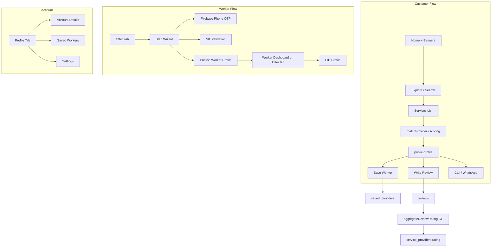

# Worknet MVP Implementation Plan

## Product framing

**Terminology (replace "Service Provider" everywhere in UI):**

- In-app label: **Worker** (user-facing: "Skilled Worker" in onboarding copy)
- Firestore collection stays `service_providers/{uid}` (no migration needed)
- Tab stays **Offer**; subtitle becomes "Become a Worker" / "Worker Dashboard"

**Two roles, one account:** any signed-in user can browse; becoming a Worker is an additive profile on the same account.

---

## Architecture overview



---

## Phase 0 — Foundation and schema cleanup

### 0.1 Unify types in [`types/database.ts`](types/database.ts)

**Simplify `ServiceProvider` (remove service area):**

- Remove: `coverageArea`, `serviceCities`, `serviceDistricts`, `serviceRadius`, `travelWillingness`, `travelLimitKm`
- Keep location: `location.latitude`, `location.longitude`, `location.geohash`, `location.homeCity`, `location.country` (for discovery only)
- Add worker verification fields (stored, not badged in MVP):
  - `phoneVerified: boolean`
  - `nicNumber: string` (encrypted or rules-restricted read)
  - `nicVerified: boolean` (manual/admin later; default `false`)
- Add social links: `socialLinks?: { facebook?: string; instagram?: string; tiktok?: string; website?: string }`
- Consolidate media: use **`workSamples: string[]`** only; remove `portfolioUrls` usage (fix drift in [`provider-profile.tsx`](<app/(app)/provider-profile.tsx>))
- Store profession as **`primaryProfessionId`** (WORKER_TYPES id, e.g. `"w2"`) + **`primaryProfession`** (display name for queries)
- Fix `experienceYears`: store as string enum (`'0-1' | '1-3' | ...`) or numeric midpoint — stop using `parseInt` on `'0–1'`

**Add types:**

```ts
interface SavedProviderEntry {
  providerId: string;
  savedAt: Timestamp;
}
interface SavedProvidersDoc {
  providerIds: string[];
  updatedAt: Timestamp;
}
// Review already exists — keep immutable
```

**Merge user types:** align [`types/user.ts`](types/user.ts) with `User` in database.ts (`isServiceProvider`, `phoneNumber`, `phoneVerified`).

### 0.2 Firestore rules ([`firestore.rules`](firestore.rules))

- `service_providers`: public read; owner write; **NIC field write-once** (allow update only if `nicNumber` unchanged or empty)
- `saved_providers/{userId}`: owner read/write (already exists)
- `reviews`: public read; create if `userId == auth.uid`; validate `rating` 1–5; no update/delete
- Add composite index: `reviews` on `(providerId ASC, createdAt DESC)` — verify in [`firestore.indexes.json`](firestore.indexes.json) if present

### 0.3 Remove service area from geo logic

In [`lib/geo.ts`](lib/geo.ts): remove provider `serviceRadius` filter from `getNearbyProviders`. Discovery uses customer location + distance sort only.

Remove service area UI from [`enroll-provider.tsx`](<app/(app)/enroll-provider.tsx>), [`public-profile.tsx`](<app/(app)/public-profile.tsx>), [`map.tsx`](<app/(tabs)/map.tsx>) filter sheets.

---

## Phase 1 — Firebase Phone Verification (worker onboarding only)

Per [Expo Firebase guide](https://docs.expo.dev/guides/using-firebase/) and [React Native Firebase phone auth](https://rnfirebase.io/auth/phone-auth): **Firebase JS SDK cannot do phone OTP on native** — requires `@react-native-firebase/auth` + **development build** (not Expo Go).

### 1.1 Native setup

Update [`app.config.js`](app.config.js):

```js
plugins: [
  '@react-native-firebase/app',
  '@react-native-firebase/auth',
  // existing plugins...
];
android: {
  googleServicesFile: './google-services.json';
}
ios: {
  googleServicesFile: './GoogleService-Info.plist';
}
```

Install: `expo-dev-client`, `@react-native-firebase/app`, `@react-native-firebase/auth`

Firebase Console:

- Enable Phone sign-in provider
- Add Android SHA-1/SHA-256 fingerprints (debug + release)
- Configure SMS region policy for Sri Lanka (+94)

### 1.2 Phone verification flow (link, not replace auth)

New module: `lib/phone-verification.ts`

- Uses `@react-native-firebase/auth`: `verifyPhoneNumber()` → OTP input → `PhoneAuthProvider.credential()` → **`linkWithCredential`** on existing Firebase JS auth user (email/Google account from [`context/auth.tsx`](context/auth.tsx))
- On success: set `users/{uid}.phoneNumber`, `phoneVerified: true` and `service_providers/{uid}.phoneVerified: true`

New UI: `components/onboarding/phone-verify-step.tsx`

- Sri Lanka default country code +94
- E.164 validation
- OTP input with resend cooldown
- Error states per error-handling-ux skill: network fail, invalid code, too many requests

**MVP constraint:** Phone verification step runs inside worker wizard only; customers keep email/Google sign-in.

---

## Phase 2 — Step-by-step worker onboarding wizard

Replace monolithic [`enroll-provider.tsx`](<app/(app)/enroll-provider.tsx>) (~1,600 lines) with a wizard route group.

### 2.1 Routes

```
app/(app)/become-worker/
  _layout.tsx          # Stack with progress header
  index.tsx            # Step 1: Welcome + requirements
  identity.tsx         # Step 2: Name, photo (required)
  verification.tsx     # Step 3: NIC + phone OTP (required)
  profession.tsx       # Step 4: Primary profession (required)
  location.tsx         # Step 5: City + map pin (required, no radius)
  details.tsx          # Step 6: Optional — WhatsApp, bio, experience, pricing, work photos, social links
  review.tsx           # Step 7: Summary + Publish
```

Shared: `hooks/use-worker-onboarding.ts` — persists draft to `AsyncStorage` + merges on publish.

### 2.2 Validation rules

| Field                 | Required | Validation                                      |
| --------------------- | -------- | ----------------------------------------------- |
| Profile photo         | Yes      | Min 200x200, max 5MB, face optional             |
| Full name             | Yes      | 2–60 chars                                      |
| NIC                   | Yes      | Sri Lanka NIC regex (old 9+V/X or new 12-digit) |
| Phone                 | Yes      | Firebase OTP verified                           |
| Primary profession    | Yes      | Must be valid WORKER_TYPES id                   |
| Location (city + pin) | Yes      | GPS or map picker                               |
| WhatsApp              | No       | E.164 if provided                               |
| Work samples          | No       | Up to 5 images                                  |
| Bio, pricing, social  | No       | Length/format limits                            |

**No verification badge in MVP:** remove/hide all `isVerified` UI in [`service-card.tsx`](components/ui/service-card.tsx), [`public-profile.tsx`](<app/(app)/public-profile.tsx>), [`provider-profile.tsx`](<app/(app)/provider-profile.tsx>). Keep `phoneVerified`/`nicVerified` as internal fields only.

### 2.3 On publish

Write `service_providers/{uid}` with:

- `availabilityStatus: 'offline'` (worker toggles on Offer dashboard)
- `rating: 0`, `reviewCount: 0`
- `createdAt` set once; `updatedAt` on every edit
- Auto-tag: push selected problem slugs into `tags[]` based on profession mapping (fixes fragile name-only matching)

Set `users/{uid}.isServiceProvider: true`.

Redirect to Offer tab dashboard.

---

## Phase 3 — Offer tab = Worker hub

Transform [`offer-service.tsx`](<app/(tabs)/offer-service.tsx>) into two states:

### 3.1 Non-worker state (onboarding CTA)

- Hero: "Become a Worker on Worknet"
- 5-step preview (matches wizard)
- Primary CTA → `/(app)/become-worker` (auth-gated)
- Secondary: "How it works" expandable

### 3.2 Worker state (dashboard)

Replace redirect to `provider-profile` with inline dashboard:

**Sections:**

1. **Status card** — availability toggle (online/offline), profile completeness %
2. **Stats row** — rating, review count, profile views (placeholder 0 for MVP)
3. **Public preview** — mini card showing how customers see them + "View public profile" → [`public-profile.tsx`](<app/(app)/public-profile.tsx>)
4. **Quick actions** — Edit profile, Add work photos, Update pricing
5. **Social links** — editable handles with visibility note ("Shown on your public profile")
6. **How you appear** — checklist: photo, profession, city, phone verified

Move provider availability toggle **out of** [`profile.tsx`](<app/(tabs)/profile.tsx>) → Offer dashboard only.

Deprecate or merge [`provider-profile.tsx`](<app/(app)/provider-profile.tsx>) into Offer dashboard + edit flow (avoid duplicate screens).

---

## Phase 4 — Profile tab = Account hub

Refactor [`profile.tsx`](<app/(tabs)/profile.tsx>):

**Signed-in user sections:**

1. **Account** — avatar, name, email, edit → [`edit-profile.tsx`](<app/(app)/edit-profile.tsx>)
2. **Saved Workers** — list from `saved_providers/{uid}`; tap → public profile; empty state CTA to Home
3. **Settings** — link to [`settings.tsx`](<app/(app)/settings.tsx>)
4. **Legal** — privacy, help
5. **Sign out**

**Remove from Profile tab:**

- "Become a Provider" card (moves to Home banner + Offer tab)
- Provider availability toggle (moves to Offer)
- Provider card premium (worker identity lives on Offer tab)

**Guest state:** keep browse-without-sign-in; improve copy.

---

## Phase 5 — Sign-in popup (auth gate UX)

Replace redirect-only [`use-require-auth.ts`](hooks/use-require-auth.ts) pattern with a modal sheet.

New: `components/ui/sign-in-sheet.tsx`

- Bottom sheet (reuse [`AppBottomSheet`](components/ui/app-bottom-sheet.tsx))
- Title from context: "Sign in to save workers", "Sign in to leave a review", "Sign in to become a Worker"
- Benefits bullets (save, review, offer services)
- Primary: Sign In → `/login?message=...`
- Secondary: Create Account → `/register`
- Dismiss without blocking browse

Update [`login.tsx`](app/login.tsx) to read and display `message` param from router.

Hook: `hooks/use-auth-gate.ts` — `gateAction({ reason, onAuthed })` opens sheet instead of hard navigation.

---

## Phase 6 — Home banners

Update [`index.tsx`](<app/(tabs)/index.tsx>):

1. **Contextual banner component** `components/ui/home-banner.tsx`:
   - Guest: "Sign in to save workers and leave reviews"
   - Signed-in, not worker: **"Become a Worker — start earning locally"** → Offer tab or become-worker wizard
   - Worker, offline: "You're hidden — go online to appear in search" → Offer tab
   - Dismissible per session (AsyncStorage)

2. Replace unused [`promo-banner.tsx`](components/ui/promo-banner.tsx) promo copy (booking discount is not MVP-accurate) or repurpose for worker CTA.

3. Curate Home problems: show **8 featured + Emergency row** from [`constants/featured-problems.ts`](constants/featured-problems.ts) (new file referencing existing PROBLEMS ids); full list remains in Explore.

4. Fix Nearby: use `getNearbyProviders` + `matchProviders` (Phase 7) instead of [`use-service-providers.ts`](hooks/use-service-providers.ts) unordered snapshot.

---

## Phase 7 — Discovery algorithm

New: `lib/match-providers.ts` — single scoring function used by Home, Services, and Map.

### 7.1 Matching pipeline

```
1. Fetch candidates (geohash within 50km default, or Firestore paginated)
2. Filter by context:
   - problem slug → primaryProfessionId in problem.workerTypes OR tags includes slug
   - worker type → primaryProfessionId match
   - search text → fuzzy name, profession, tags, bio
3. Score each provider (0–100):
   - professionMatch: 40 pts (exact id match) / 20 pts (tag match)
   - distance: 25 pts (linear decay, 0 at 50km)
   - availability: 15 pts (online = full)
   - rating: 10 pts (normalized 0–5)
   - reviewCount: 5 pts (log scale, caps spam)
   - profileCompleteness: 5 pts (photo, bio, work samples, pricing)
4. Sort by score DESC, tie-break by distance ASC
5. Return top N with matchReason string for UI ("Plumber · 1.2 km · Available")
```

### 7.2 Refactor [`services.tsx`](<app/(tabs)/services.tsx>)

- Extract filtering into `lib/match-providers.ts` + `hooks/use-matched-providers.ts`
- Fix bugs: apply `selectedCategory`, use profession **id** not display name, fix LKR price buckets (replace USD labels in [`filter-sheet.tsx`](components/ui/filter-sheet.tsx))
- Default chip: **Best Match** (algorithm) instead of raw Nearest
- Show `matchReason` under card title

### 7.3 Taxonomy improvements

- [`constants/worker-types.ts`](constants/worker-types.ts): add `slug` field to each worker type (for stable routing)
- [`constants/problems.ts`](constants/problems.ts): audit 33 problems — sufficient for MVP; group into categories for Explore sections (Home Repair, Cleaning, Vehicle, Emergency)
- Explore worker tap: pass `professionId=w2` param instead of `searchText=Plumber`

### 7.4 ServiceCard updates

[`service-card.tsx`](components/ui/service-card.tsx):

- Show rating + review count (props exist but unused)
- Remove verified badge
- Optional save heart icon (auth-gated)

---

## Phase 8 — Saved workers

New: `hooks/use-saved-providers.ts`

**Data model:** `saved_providers/{userId}` document:

```ts
{ providerIds: string[], updatedAt: Timestamp }
```

**UI touchpoints:**

- Heart toggle on [`public-profile.tsx`](<app/(app)/public-profile.tsx>) header
- Heart on `ServiceCard` long-press or corner icon
- Saved list on Profile tab with `ServiceCard` compact variant
- Auth gate via sign-in sheet

---

## Phase 9 — Reviews and ratings

### 9.1 Cloud Function

Extend [`functions/src/preventDuplicateReview.ts`](functions/src/preventDuplicateReview.ts) or add `aggregateReviewRating.ts`:

- On `reviews/{id}` create: recompute `rating` (average) and `reviewCount` on `service_providers/{providerId}`
- Keep duplicate prevention (one review per user per provider)

Deploy via existing [`firebase.json`](firebase.json) functions config.

### 9.2 Client

New: `components/reviews/review-list.tsx`, `components/reviews/write-review-sheet.tsx`

**public-profile.tsx:**

- Reviews section: list with star, name, date, comment
- "Write a review" button (auth-gated, one per user — check existing review)
- Aggregate rating in hero

**Write flow:**

- Star picker 1–5 + optional comment (max 500 chars)
- Optimistic UI with error recovery
- Success toast + refresh provider snapshot

---

## Phase 10 — Public profile and contact polish

[`public-profile.tsx`](<app/(app)/public-profile.tsx>):

- Remove service area section
- Add social links row (open in browser)
- Pre-filled WhatsApp message: `"Hi [Name], I found you on Worknet. I need help with [problem/profession] in [city]. Are you available?"`
- Save + Review actions in header/footer
- Remove verified badge

---

## Phase 11 — UI/UX quality bar

Apply referenced skills consistently:

| Skill                             | Application                                                                       |
| --------------------------------- | --------------------------------------------------------------------------------- |
| building-native-ui                | Native tabs, stack headers, bottom sheets, haptics                                |
| ios-hig-design                    | 44pt touch targets, system sheets, clear hierarchy                                |
| mobile-design                     | Thumb-zone CTAs, one primary action per screen                                    |
| high-end-visual-design / hallmark | Restrained palette from [`theme.ts`](constants/theme.ts), no generic AI gradients |
| motion-design                     | Wizard step transitions (Reanimated layout), sheet spring                         |
| error-handling-ux                 | Inline field errors, retry on network, empty states with action                   |
| react-native-best-practices       | Memo ServiceCard, stable list keys, avoid inline fetches in render                |

**Wizard UX:** progress indicator (Step 3 of 7), back/next footer, save draft on background.

---

## Phase 12 — Testing and build checklist

1. **Dev client build** required for phone OTP — run `eas build --profile development`
2. Test flows:
   - Guest browse → sign-in sheet → save worker
   - Full worker wizard with OTP + NIC validation
   - Publish → appears in search when online
   - Write review → rating updates on profile and cards
   - Edit worker profile from Offer dashboard
3. Firestore emulator tests for review aggregation (optional)
4. Remove dead code: old monolithic enroll fields, verified badge assets, service radius map circle

---

## File change summary

| Action             | Files                                                                                                                                                                                                                                                                                                                                   |
| ------------------ | --------------------------------------------------------------------------------------------------------------------------------------------------------------------------------------------------------------------------------------------------------------------------------------------------------------------------------------- |
| **New**            | `app/(app)/become-worker/*`, `lib/match-providers.ts`, `lib/phone-verification.ts`, `hooks/use-saved-providers.ts`, `hooks/use-auth-gate.ts`, `hooks/use-matched-providers.ts`, `components/ui/sign-in-sheet.tsx`, `components/ui/home-banner.tsx`, `components/onboarding/*`, `components/reviews/*`, `constants/featured-problems.ts` |
| **Major refactor** | `offer-service.tsx`, `profile.tsx`, `services.tsx`, `index.tsx`, `public-profile.tsx`                                                                                                                                                                                                                                                   |
| **Schema/rules**   | `types/database.ts`, `types/user.ts`, `firestore.rules`, Cloud Functions                                                                                                                                                                                                                                                                |
| **Config**         | `app.config.js`, `google-services.json`, `GoogleService-Info.plist`, add `expo-dev-client`                                                                                                                                                                                                                                              |
| **Remove/hide**    | Verified badge UI, service area fields/UI, `promo-banner` booking copy                                                                                                                                                                                                                                                                  |
| **Deprecate**      | Monolithic `enroll-provider.tsx` (redirect to wizard), `provider-profile.tsx` (merge into Offer)                                                                                                                                                                                                                                        |

---

## Implementation order (recommended)

1. Schema cleanup + remove service area + hide verified badges
2. `match-providers` algorithm + Services/Home refactor
3. Sign-in sheet + login message param
4. Saved workers (hook + UI)
5. Reviews (Cloud Function + UI)
6. Firebase native phone auth setup + dev client
7. Worker onboarding wizard
8. Offer dashboard + Profile hub refactor
9. Home banners + featured problems
10. Polish, test, deploy functions
